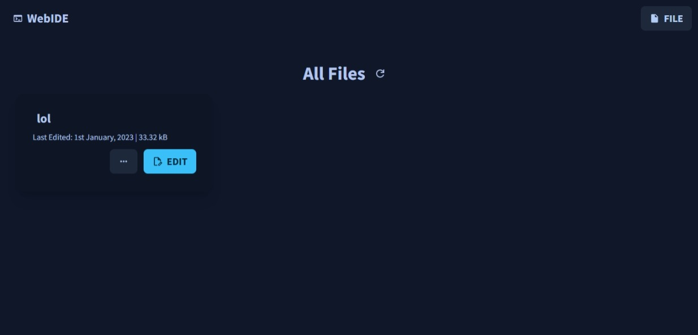

# WebIDE - a web-based code editor

This project will be my first (or maybe only) project in 2023. 

WebIDE is a web-based code editor which designed to save, load, write and also compile codes. MySQL database will be used in this project.

## Inspiration

This project is inspired by [Codex](https://github.com/Jaagrav/CodeX), which made by [Jaagrav](https://github.com/Jaagrav). For this project to be different, I will include a database to save all source files and also user data on a server so all files can be accessed at every time.

## To-do List

- [ ] Home Page
  - [x] Basic Layout
  - [ ] Message Boxes
  - [ ] Modals
- [ ] Editor 
  - [ ] Page Layout
  - [ ] Code Editor Setup
  - [ ] Remote Compiler
    - [ ] System Layout
    - [ ] Input / Output Cases
- [ ] Backend
  - [x] Remote Compiling System
  - [ ] REST API